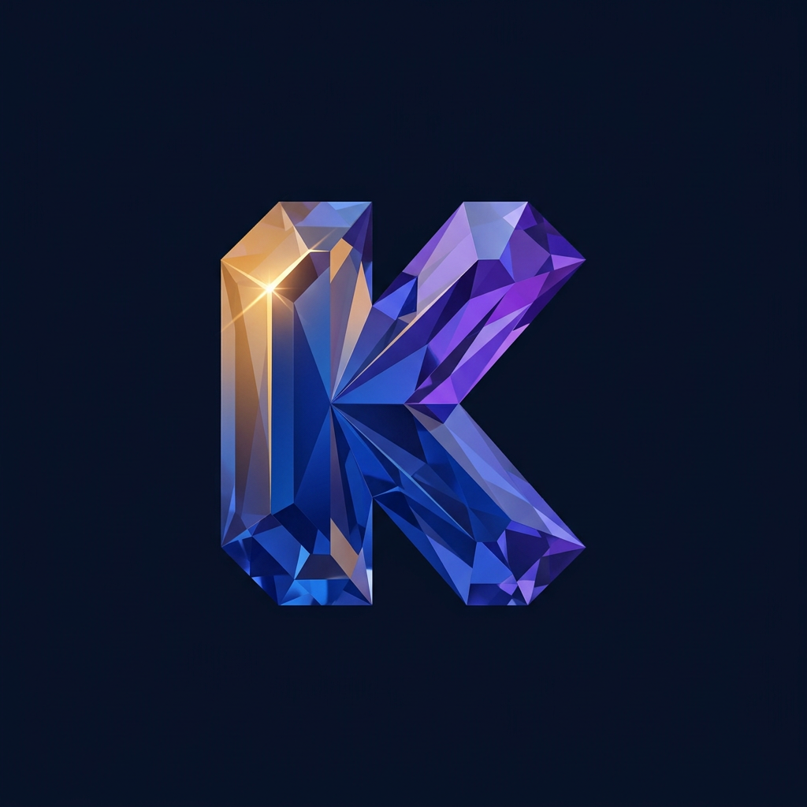

<p align="center">
  
</p>

# Karat

**Karat is a community-first lightweight IDE developed by [XySpace](https://github.com/xykalnotkel).** It combines a Rust/Tauri core with Monaco and a quiet, Surface-friendly interface. The project targets Windows, Linux, Android, and an optional browser-hosted mode.

> **Status: v0.3.0 alpha.** Karat is useful today, but APIs and storage formats may still change. Android and browser mode intentionally provide fewer native capabilities than desktop.

## Features

| Area | Capability |
|---|---|
| Editor | Monaco, 40+ languages, tabs, minimap, dirty state, sticky scroll |
| Workspace | Explorer, native Open Folder, create, rename, delete, full-text search |
| Terminal | Native PTY with detected PowerShell, cmd, WSL, Bash, Zsh, Fish, Nushell, and POSIX profiles |
| Run | Context-aware commands for Rust, Node.js, Python, and other common files |
| Git | Branch/status view, staging, and commits through the installed Git CLI |
| Navigation | Fuzzy Quick Open and Command Palette |
| Extensions | Named folders, local VSIX import, and Open VSX safe-compatibility installation |
| Experience | HTML Live Preview, semantic file icons, ANSI terminal colors, dark/light themes, and quiet chrome |

## Quick start

Prerequisites are **Node.js 20+** and **Rust stable**.

```bash
git clone https://github.com/xykalnotkel/karat-IDE.git
cd karat-IDE
npm run setup
npm run web:build
cargo test --all-targets
npm run tauri:dev
```

## Platform builds

### Windows

Building on Windows additionally requires Microsoft C++ Build Tools as the Rust linker/toolchain. Karat itself is built from scratch with Rust, TypeScript, Monaco, and Tauri; Visual Studio is **not** an application/runtime dependency and installer users do not need it.

```powershell
npm run setup
npm run tauri:build
```

Tauri creates NSIS `.exe` and WiX `.msi` installers under `src-tauri\target\release\bundle`. WebView2's offline installer and all frontend assets are bundled, so normal editor use can remain offline.

Official CI artifacts may be cryptographically self-signed by the project, but Windows can still display **Unknown Publisher** until XySpace uses a publicly trusted code-signing certificate.

### Linux

Debian/Ubuntu build prerequisites:

```bash
sudo apt install libwebkit2gtk-4.1-dev build-essential curl wget file \
  libxdo-dev libssl-dev libayatana-appindicator3-dev librsvg2-dev
npm run setup
npm run tauri:build
```

Release builds produce `.deb`, `.rpm`, and `.AppImage` artifacts.

### Android

Android builds require Android Studio/SDK, NDK 27, Java 17, and the Rust Android targets.

```bash
npm run setup
npm run android:init       # only if src-tauri/gen/android is absent
npm run android:build      # APK + AAB, ARM 32-bit and ARM 64-bit
```

CI's universal APK/AAB contains `armeabi-v7a` and `arm64-v8a`. `minSdk 24` supports Android 7 and newer. Android uses private app storage and a touch-optimized layout. Editing, exploring, saving, search, Open VSX browsing, GitHub login, and a bounded `/system/bin/sh` command console are available. Local Git CLI and a true interactive PTY remain desktop-only.

### Web mode

```bash
npm run web:build
cargo run                  # backend and frontend on http://127.0.0.1:3000
```

| Variable | Default | Purpose |
|---|---|---|
| `KARAT_ROOT` | `./workspace` | Web workspace directory |
| `KARAT_HOST` | `127.0.0.1` | Listener address |
| `KARAT_PORT` | `3000` | Listener port |
| `KARAT_AUTH_TOKEN` | empty | Required URL-safe token (16+ characters) off loopback |

For LAN/container access, set a strong random token and use HTTPS through a reverse proxy. Do not expose development mode directly to the public internet.

## Workspace location

On first desktop launch, Karat creates a user-owned workspace:

- Windows: `C:\Users\<user>\Karat Workspace`
- Linux and macOS: `~/Karat Workspace`
- Android: private app storage

This avoids placing a broad filesystem root or sensitive profile files inside the project view. Desktop users can choose another folder with **File → Open Folder**.

## GitHub account

The GitHub activity view supports fine-grained Personal Access Tokens and GitHub OAuth Device Flow. Tokens are held in session storage and are not written to project files. Device Flow requires a public GitHub OAuth App Client ID with Device Flow enabled; no client secret is embedded in Karat.

## HTML Live Preview

Open an `.html` file and select **View → HTML Live Preview** or the eye button in the tab bar. Updates are debounced and rendered in a sandboxed iframe. HTML and CSS work immediately; scripts remain constrained by Karat's Content Security Policy. Relative multi-file asset serving is planned for a later preview-server iteration.

## Extension API v1

Desktop users can choose **Extensions → Install from Folder**. Karat validates and copies the selected named folder to:

```text
<workspace>/.karat/extensions/<extension-id>/extension.json
```

Example `extension.json`:

```json
{
  "id": "project-tools",
  "name": "Project Tools",
  "version": "1.0.0",
  "description": "Useful commands for this project",
  "author": "Example Author",
  "commands": [
    { "id": "test", "title": "Run tests", "terminal": "npm test" }
  ]
}
```

IDs accept ASCII letters, numbers, `-`, and `_`. Installation rejects symbolic links and enforces count/size limits. Extension v1 never evaluates third-party JavaScript; a contributed terminal command runs only after an explicit user action. Review commands before running them.

Karat can search Open VSX and safely import local `.vsix` packages. Imported files are bounded and archive paths are validated. Karat records supported theme, icon-theme, snippet, and grammar contributions, but does not execute a package’s JavaScript extension host. Karat therefore does **not** claim full VS Code compatibility; unsupported extensions can be installed as resources but will not run their Node/VS Code APIs.

## Architecture

```text
karat/
├── src/          Rust core and optional Axum web server
├── src-tauri/    Desktop/mobile Tauri application and native IPC
├── frontend/     Framework-free TypeScript UI using Monaco and xterm.js
├── assets/       XySpace/Karat source branding
└── workspace/    Small demonstration workspace
```

Desktop calls the Rust core through Tauri IPC without an HTTP server. Web mode exposes the same contained file, Git, and terminal services through authenticated Axum APIs.

## Contributing and collaboration

Karat is suitable for open-source contributions and collaboration, especially in platform testing, accessibility, documentation, localization, terminal integration, and the declarative extension ecosystem.

- Read [CONTRIBUTING.md](CONTRIBUTING.md) and the [Code of Conduct](CODE_OF_CONDUCT.md).
- Use issues for reproducible bugs and scoped proposals; use Discussions for broader designs and collaboration.
- Report vulnerabilities privately according to [SECURITY.md](SECURITY.md).
- Governance and maintainer expectations are in [GOVERNANCE.md](GOVERNANCE.md).
- Support routes are listed in [SUPPORT.md](SUPPORT.md); authorship is documented in [AUTHORS.md](AUTHORS.md).
- Changes are tracked in [CHANGELOG.md](CHANGELOG.md).

GitHub Sponsors configuration is prepared for XySpace's repository owner. Sponsorship becomes active only if that account enrolls and enables it; no alternative payment destination is implied.

## Roadmap

- Language Server Protocol, diagnostics, hover, and navigation
- Problems/output panels, multiple terminals, and diff view
- Settings and keybinding editors
- Carefully sandboxed extension capabilities
- Updater publication after stable signing and release-channel design
- Advanced Git workflows and package-manager distribution

## Shortcuts

| Shortcut | Action |
|---|---|
| `Ctrl+S` | Save |
| `Ctrl+P` | Quick Open |
| `Ctrl+Shift+P` | Command Palette |
| `Ctrl+Shift+F` | Search files |
| `Ctrl+B` | Toggle sidebar |
| ``Ctrl+` `` | Toggle terminal |
| `Ctrl+F` | Find in file |

## License and attribution

Karat is available under the [MIT License](LICENSE). Copyright © 2026 XySpace and Karat contributors. “Karat,” its project identity, and official releases are developed and coordinated by **XySpace**.
